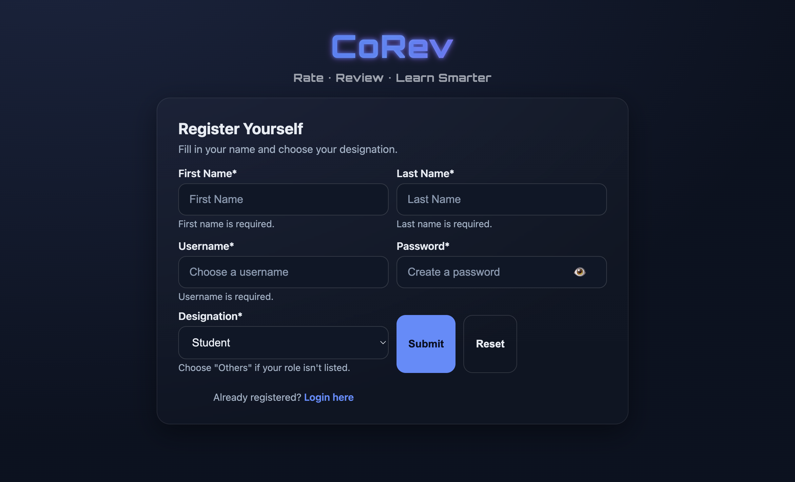
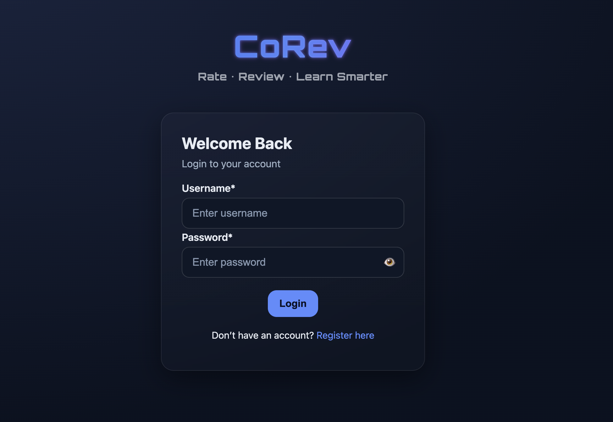
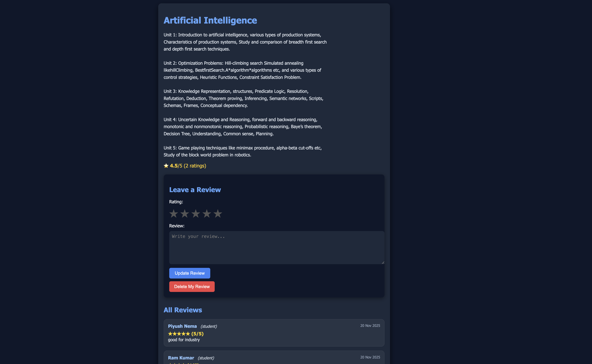

#  CoRev — Course Review & Rating Platform
<p align="center">
  
</p>

A modern Flask + MongoDB application for reviewing and rating college subjects.

<p align="center">
  
  
  
</p>

## About CoRev:

CoRev (Course Review) is a platform where students and educators can:

-> View detailed course descriptions

-> Rate and review subjects

-> View average ratings per subject

-> Manage their own reviews

-> Authenticate through a secure login system (hashing included)

This project is built using Flask (Python) and MongoDB, with a clean UI powered by HTML, CSS, and JS.

## Features

🔐 User Authentication
	•	Secure password hashing
	•	Login & Logout
	•	Session-based protection

📘 Course Listing
	•	Automatically imported from JSON + TXT descriptions
	•	Images for each subject
	•	Clean dashboard layout

⭐ Review System
	•	Add rating (1–5 stars)
	•	Add course review text
	•	Update & delete own reviews
	•	Average rating displayed across site

🔍 Search Functionality
	•	Real-time search filtering without page reload

📁 Modular Flask Architecture
	•	Blueprints for clean routing
	•	Scripts for importing subjects

## ⚙️ Tech Stack

🎨 Frontend
	•	HTML5
	•	CSS3
	•	JavaScript

🧩 Backend
	•	Python 3.10+
	•	Flask
	•	Flask-PyMongo

💾 Database
	•	MongoDB

☁ Deployment
	•	GitHub

## 📂 Project Structure
```
CoRev/
│
├── app.py
├── requirements.txt
├── .gitignore
│
├── routes/
│   ├── __init__.py
│   ├── register_route.py
│   ├── login_route.py
│   ├── logout_route.py
│   ├── dashboard_route.py
│   └── subject_route.py
│
├── scripts/
│   ├── import_subjects.py
│
├── subjects/
│   ├── subjects.json
│   └── descriptions/*.txt
│
├── static/
│   ├── css/
│   ├── js/
│   └── images/
│
└── templates/
    └── html/
        ├── login.html
        ├── registration.html
        ├── dashboard.html
        ├── subject.html
        └── logo.html
```

## 🛠 Installation

### 1. Clone the repository

```bash
git clone https://github.com/p2314n/CoRev.git
cd CoRev
```

### 2. Create and activate a virtual environment

```bash
python3 -m venv venv
source venv/bin/activate        # macOS/Linux
venv\Scripts\activate           # Windows
```

### 3. Install dependencies

```bash
pip install -r requirements.txt
```

### 4. Setup the database  
Start MongoDB locally (or use MongoDB Compass).

### 5. Import subjects

```bash
python scripts/import_subjects.py
```

### 6️⃣ Run the server

```bash
python app.py
```

Then open your browser at:

👉 http://localhost:8000


##  📸 Screenshots

Registration Page:



Login Page:



Dashboard/Home Page:


Subject Page:



##  Future Improvements

-> Email verification

-> Admin dashboard

-> Export reviews

-> Analytics Report (using Data science and AI/ML)

